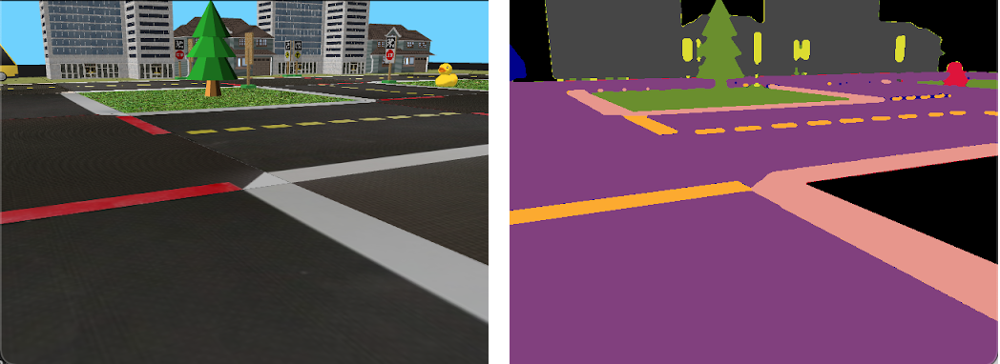

## Duck Vision

### Integrating the OAK-D from OpenCV’s AI Kit into the Duckietown Ecosystem

**Team name**: Duck Vision  
**Region 3**: Europe + Russia + Australasia  
**Team type**: General team  
**Category**: Robotics, education  

### What is Duckietown?
Duckietown ([duckietown.org](https://www.duckietown.org/)) is an open source platform used for teaching and research purposes for autonomous vehicles and robotics in more than 90 universities around the world. The Duckietown project started at MIT in 2016, with the scope of making robotics classes more practical, more interactive, and accessible to everyone. Duckietown is a small-scale environment composed of roads, intersections, street markings, and of course, “Duckiebot” robots which drive around in a complex multi-agent system.

Image credit: duckietown.org

### Project motivation
The goal of our “Duck Vision” project was the integration of the OAK-D device from OpenCV’s AI Kit into the Duckietown platform. We think that the integration of OAK-D in the Duckietown infrastructure can boost autonomous car software development and research, as well as expose students who are working in the Duckietown framework to spatial AI and stereo vision.

### Scope
A Duckiebot has only one visual sensor: a small camera. By integrating the OAK-D, our goal was to enhance the perception pipeline of the robot, giving a spatial representation of the environment and boosting the computational power of the car by offloading some computation to the OAK-D device. The OAK-D is not just a stereo camera, instead it represents the latest in terms of on-edge computation platforms. That is, given the onboard Vision Processing Unit (VPU), it is able to accelerate machine vision processing tasks like object recognition, gesture detection, and so on, bringing computer vision to the next level.

The project we are presenting aims to create documentation and support for the OAK-D in Duckietown, developing the didactic material and a demo. The didactic material is part of the documentation, with simple student exercises and tutorials on reading camera data in real-time, stereo vision, and machine learning (ML) applications. We also developed and 3D printed a mount to easily attach the OAK-D to the front of Duckiebot vehicles.

Since stereo vision and machine learning are the two cornerstones of the research in the autonomous systems field, we think that integrating the OpenCV and Luxonis device in Duckietown represents a step forward for the study of autonomous driving. For this reason, we are putting our effort into the Duck Vision project, hoping that it can be helpful to future students and researchers.

### About the team
We are two Masters students in Robotics, Systems, and Control at ETH Zürich. [Trevor](https://github.com/trevphil) is doing his Master’s thesis at NASA Jet Propulsion Laboratory (JPL) on dense monocular 3D reconstruction, and has previous experience in software engineering and in machine learning research. He has a Bachelors in Computer Science and Engineering from the University of Connecticut. [Vincenzo](https://github.com/viciopoli01) is also doing his Master’s thesis at NASA Jet Propulsion Laboratory (JPL) on multi UAV systems, and he is a lab assistant in the Duckietown lab at ETH Zürich. He previously developed a mobile app to guide tourists around cities using Augmented Reality. He has a Bachelors in Automation Engineering from Politecnico di Milano. Both worked on the parking area project during the Duckietown course at ETH https://github.com/duckietown-ethz/proj-parking.

### Video demonstrations
Lane following using the OAK-D
Semantic segmentation using the OAK-D

### Project details
(e.g. explanation of the changes to Duckietown software infrastructure to enable switching from normal camera to OAK-D)
The Duckietown platform is composed of many tools and wrappers that make it easy to work and extend the platform. However, these variety of tools act on the "abstract" level of the platform, namely the part of line detection, control and so on. For example it's straightforward to create a new ROS node that detects colors, or lines. For these reasons, when one wants to integrate a new sensor the process is a little trickier, indeed for maintaining the structure of the platform, one should modify the so-called "dt-duckiebot-interface". In the case of our project we are in the middle of the two solutions, indeed the OAK family is not just a camera but it brings an API to interface with the sensor itself. This makes more difficult the integration in the dt-duckiebot-interface, that is thought for the raw sensor communication, and it makes also uncomfortable the creation of a new Docker container that replaces the existing camera node. In order to solve this problem, we modified the Duckiebot interface adding a flag that can disable the camera node. In this way then it's easier to create a new docker container that runs the OAK-D as the main camera. In order to integrate this change in the Duckietown environment, we also developed a new command for the Duckietown shell. Now the user for switching off the camera node permanently on the robot interface needs to run "dts duckiebot camera --stop DB_NAME", same command for starting the camera with the flag --start. 
This was the first step we did for integrating the OAK in Duckietown. 
All the Duckietown environment is composed of several Docker containers, in particular to develop a new software feature the user needs to use the existing templates. We created a new template that integrates the DepthAI API and the DTROS (Duckietown ROS). This new template called oakd-template makes it easy to create a DepthAI application in Duckietown. 
We supported this work with a set of tutorials that show how to make inference on images using the DepthAI libraries. These tutorials are designed as Jupyter notebooks, and similarly to the Duckietown shell exercises command, we replicated a set of shell commands to build and test the notebooks on the computer and on the robot.
Finally, to mount the camera on the robot, we designed a simple camera support, modifying the official one.
All the code and the camera code are available on the github repo Duck Vision.

### Camera mount
(3D printed mount, e.g. CAD screenshot or something like that)

### Semantic segmentation
To demonstrate for future students how the OAK-D can be used in the context of machine learning (ML) in Duckietown, we developed a semantic segmentation network trained specifically for the Duckietown environment. Our model is an encoder-decoder network based on DeepLabv3+ [1] and utilizing a ResNet34 [2] backbone with ASPP [3] for robustness to change in object scale. The model was trained using 1500 images from the Duckietown simulator with ground-truth semantic labels and a 4:1:1 train-validation-test split. The classes learned by the model include:
Pedestrian (Duckie)
Lane
Lane marking
Lane edge
Vehicle (Duckiebot)
Vertical sign
Nature
Building
“Other” category (unknown)

Pictured: sample image from simulation (left) with ground-truth semantic labels (right)

A few samples comparing the ground truth vs. predicted segmentation mask are given below:

Pictured: input image (top), ground truth segmentation (middle), prediction (bottom)

Our loss function weights classes inversely to their relative frequency in the training dataset, such that classes which appear less often (e.g. pedestrians) receive higher weight during training and those that appear more often (e.g. lanes) are given less weight.

After training in PyTorch, we exported our model to ONNX and subsequently converted it to the required “blob” file format using OpenVINO and were able to run it on the OAK-D attached to the Duckiebot. Unfortunately, despite model optimizations from OpenVINO, inference on the OAK-D was quite slow and we were only able to achieve a rate of about 1 Hz. There also seems to be a bug in OpenVINO which prevents the datatype of the model output layer from using 8-bit integers.

The trained model was able to detect a pedestrian (Duckie) outside of simulation, as shown in our video and the visualization below:

Pictured: real-world usage of our trained model to segment a “pedestrian” (Duckie)

### Major challenges
(depthai API is constantly changing and very buggy, limited support with Docker)

### Future work
To extend our work in the future, we would like to propose a few other use cases of the OAK-D in Duckietown which could be developed to help students learn about robotics and autonomous vehicles. One example would be the implementation of a visual odometry (VO) system. A very simple form of this system could be to track features between sequential frames, and to produce a 3D point cloud in the first frame using the OAK-D’s stereo vision. Finding the relative motion of the second frame could be achieved by solving for a rigid body transformation via a non-linear optimization which minimizes the reprojection error of the 3D point cloud vs. the tracked feature positions in the second frame. Utilizing semantic information to match features more robustly would extend this system into the machine learning realm.

Other extensions, such as simultaneous localization and mapping (SLAM) systems which utilize the OAK-D’s stereo vision, would also be relevant. Finally, deep learning applications like detection of bounding boxes of Duckies or other Duckiebots in the environment would be a way for students to practice machine learning while also understanding how to prepare a model for inference “in production.”

### Source code
oakd-tutorials - Jupyter notebooks demonstrating OAK-D integration (reading cameras, stereo, machine learning) with Duckietown (software infrastructure, ROS, Docker)
dt-gui-tools-oakd - description
duckietown-shell-commands-oakd - Set of commands for stop and start the official camera, build and test the oaks tutorials.
...

### Acknowledgements
We want to say thanks to the Duckietown lab for the possibility they gave us to test our results in their lab at ETH and for providing us also the Duckiebots.

### References
[1] Liang-Chieh Chen, Yukun Zhu, George Papandreou, Florian Schroff, & Hartwig Adam. (2018). Encoder-Decoder with Atrous Separable Convolution for Semantic Image Segmentation. 
[2] Kaiming He, Xiangyu Zhang, Shaoqing Ren, & Jian Sun. (2015). Deep Residual Learning for Image Recognition. 
[3] Yu Zhang, Xin Sun, Junyu Dong, Changrui Chen, & Yue Shen. (2020). High-Order Paired-ASPP Networks for Semantic Segmentation. 
